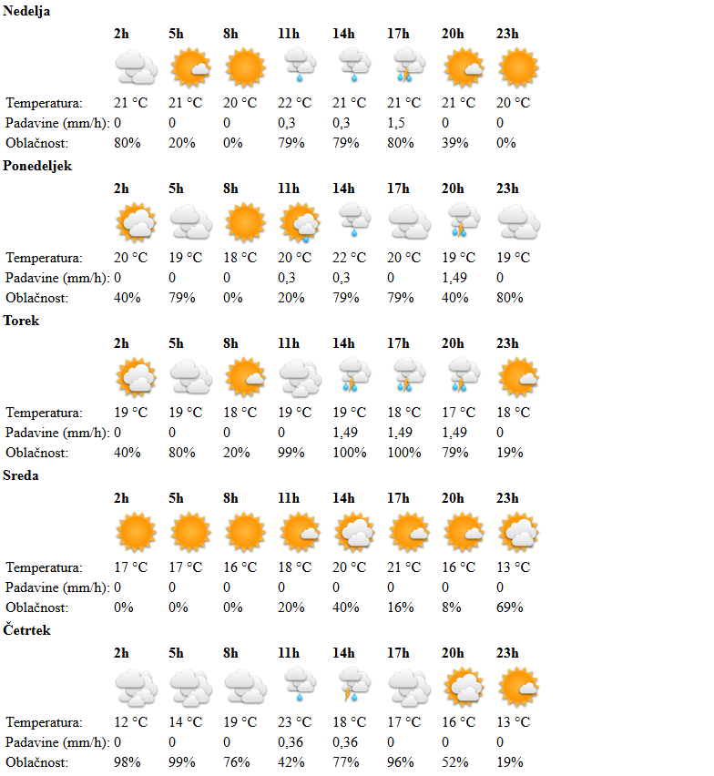

# Hribko

John Hribko, Jr.
A Discord bot that fetches mountain weather forecasts from hribi.net and replies with a rendered forecast image.

## Setup

1. Run `npm install`.
2. Create a `.env` file with `DISCORD_TOKEN` and `PREFIX`.
3. Start the bot with `node index.js`.

Send `<PREFIX> <mountain name>` in Discord to request a forecast.

## Example

## TODO
* John Hribko, Jr. is typing ...
